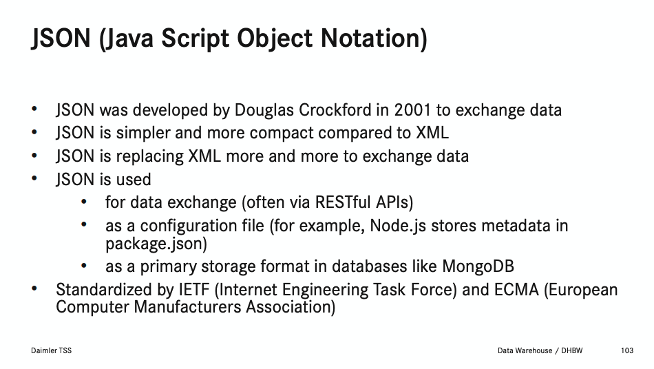

## CSV (Comma-separated values)

CSV, zu Deutsch Komma separierte Werte, ist ein Dateiformat das in Form einer Textdatei zur Speicherung und Austausch von einfach strukturierten Daten verwendet wird. Dabei werden einzelne Werte durch Kommas, aber auch anderer üblicher Trennzeichen wie ';' oder '|', getrennt [1]. _Abbildung 1_ zeigt wie so eine Datei beispielsweise aussehen könnte.

```
id,Title,Year,Rated,Genre
1,The Shawshank Redemption,1994,R,"Crime, Drama"
2,The Godfather,1972,R,"Crime, Drama"
3,The Godfather: Part II,1974,R,"Crime, Drama"
4,The Dark Knight,2008,PG-13,"Action, Crime, Drama"
5,12 Angry Men,1957,APPROVED,"Crime, Drama"
6,Schindler's List,1993,R,"Biography, Drama, History"
7,The Lord of the Rings: The Return of th...,2003,PG-13,"Adventure, Drama, Fantasy"
8,Pulp Fiction,1994,R,"Crime, Drama"
```
<i style="font-size: 80%">Abbildung 1: 8 von 250 Einträge über die besten Filme aus einer Komma getrennte CSV-Datei [2].</i>

Darüber hinaus zeigt _Abbildung 1_ auch, dass neue Linien Einträge jeweils die gleich Anzahl an Werteinträge besitzt. Lässt man diese CSV-Textdatei über eine repräsentative Konvertierung anzeigen, erhält man eine Tabelle wie in _Abbildung 2_.

| id  |           title            | year |   rated   |         genre          | 
| --- | -------------------------- | ---- | --------- | ---------------------- |
|   1 | The Shawshank Redemption   | 1994 | R         | Crime, Drama           |
|   2 | The Godfather              | 1972 | R         | Crime, Drama           |
| ... | ...                        | ...  | ...       | ...                    |  
|   7 | The Lord of the Rings: T...| 2003 | PG-13     | Adventure, Drama, Fantasy |
|   8 | Pulp Fiction               | 1994 | R         | Crime, Drama           |
<i style="font-size: 80%">Abbildung 2: Schematische Tabelle, erstellt durch die Markdown Umsetzung.</i>


## JSON (JavaScript Object Notation)

JSON, zu Deutsch JavaScript Objekt Notation, ist ein Dateiformat, dass basierend auf der JavaScript Programmiersprache Daten strukturiert speichern kann. Dabei verwendet es benannte, ungeordnete Listen, geordnete Listen und Key-Value-Paare. Diese Struktur lässt sich verschachteln, sodass ein Value zum Beispiel eine ungeordnete Liste beeinhaltet. _Abbildung 3_ zeigt wie das JSON-Format unter anderem zum Einsatz kommt [3]. 


<i style="font-size: 80%">Abbildung 3: Weitere Information über das JSON Dateiformat [4].</i>

Die Paralleldatei zur _Abbildung 1_ im JSON-Format würde wie in der folgenden _Abbildung 4_ aussehen.

```json
[
    {
        "id":1,
        "title":"The Shawshank Redemption",
        "year":1994,
        "rated":"R",
        "genre":"Crime, Drama"
    },
    ...
    {
        "id":8,
        "title":"Pulp Fiction",
        "year":1994,
        "rated":"R",
        "genre":"Crime, Drama" 
    }
]
```
<i style="font-size: 80%">Abbildung 4: Film Liste, beispielhaft Einträge 1 und 8 im JSON-Format [2].</i>

Auch diese kann wie in Abbildung 2 zu sehen, in eine Tabelle konvertiert werden.

Wie schon der Titel des Katakodas andeutet, werden wir nun besprechen wie wir diese zwei Dateiformate importieren bzw. exportieren können.